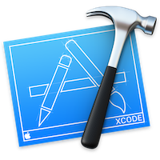

+++
title = "0. Introduction"
date = 2020-03-14
reading_time = 50
+++

Before diving into the problems and start throwing code at it, let me tell you about the structure of the project, the goals and how things are supposed to work around here.
<!-- more -->
||
|-|
# Goal
Learn more about [RxSwift](https://github.com/ReactiveX/RxSwift) by building a _different_ kind of sample app based on [Swift](https://developer.apple.com/swift/) and [SwiftUI](https://developer.apple.com/xcode/swiftui/) using [Xcode](https://developer.apple.com/xcode/).
Why [RxSwift](https://github.com/ReactiveX/RxSwift)?  
The best answer for that is [here](https://github.com/ReactiveX/RxSwift/blob/master/Documentation/Why.md)

||
|-|
# Motivation
I find myself learning about new things that can be achieved with RxSwift by reading other people's code, rarely by reading posts about how `map` or `flatMap` works.  
Maybe I lack the imagination necessary to translate all those marble diagrams and fake static number generators nobody use into "_real world_" problems, perhaps that's not the way I learn, or you know, maybe I haven't tried hard enough.

Anyway, I decided to start tinkering with RxSwift a little more, I googled and asked on twitter ([here](https://twitter.com/dev_jac/status/1230657972470075392)), I found the usual books, [RxSwift: Reactive Programming with Swift](https://store.raywenderlich.com/products/rxswift), the usual talks like the ones at [Realm Academy](https://academy.realm.io/posts/learning-path-rxswift-from-start-to-finish/) and tutorials which usually cover individual aspects like operators and always using those damn marbles 🙄  

I started hanging around the RxSwift repository reading the [docs](https://github.com/ReactiveX/RxSwift/tree/master/Documentation) (they are great), and one thing I found that is invaluable for experimenting is the Swift Playground that comes with the repo ([here](https://github.com/ReactiveX/RxSwift/blob/master/Documentation/Playgrounds.md)) this is a tool you should always keep at hand.

After some time, I decided the best way to learn more was to create a dummy app and play with it, but what kind of app?  
Most of the apps one can build for tinkering are passive, meaning you find a free service that returns some fancy data, like [Open Weather Map](https://openweathermap.org/api), you fetch it and render it nicely, and that's it. What kind of "Reactive" stuff can be built around a bunch of GET HTTP calls that always return the same thing???  

<big>🌤🌥🌦🌨🌩⛈🌪</big>

If you are lucky you might find a nice open API that also includes some POST and PUT HTTP calls (like [The Movie Database API](https://developers.themoviedb.org/3/account/mark-as-favorite)) but still, is not very reactive and also kinda limiting if you want to explore other concepts like unit testing or if you want to tinker in a reactive but repetitive way that let you try different approaches for the same situation.

As I wrote on my [twitter bio](https://twitter.com/dev_jac) a long time ago, "_If it doesn't exist I'll make it_".

Initially, I started building it just for myself and it was never intended to be shared, so let me warn you, it is going to be rough around the edges… and sometimes on the middle, top, bottom, front, and rear too 😅.

I'm sharing it because, in the same way, you might [figure out a bug while explaining it to a rubber duck 🦆](https://en.wikipedia.org/wiki/Rubber_duck_debugging) teaching something you think you understand to someone else also helps you understand it better yourself.

Also, I thought this whole blogging thing was going to be easier, but so far is torture! ☠️

Without more preamble, let's discuss the technology stack 🥞.

||
|-|
# Technology

The bundle versions of [Swift](https://developer.apple.com/swift/) and [SwiftUI](https://developer.apple.com/xcode/swiftui/) that comes with [Xcode](https://developer.apple.com/xcode/) (right now it is 11.4 beta 3 (11N132i)) will be used and therefore recommended to follow this posts.

The project has 2 dependencies:
1. RxSwift [5.1.0](https://github.com/ReactiveX/RxSwift).
2. FakeService, a toy Swift framework built for this project.

RxSwift will be integrated using [Swift Package manager](https://swift.org/package-manager/).  
**FakeService** is pre-loaded and configured on the sample project.

The objective of this project is to explore the capabilities of RxSwift and try to build complex/funny contractions with it, SwiftUI and Swift Package manager were chosen because those require less explanation and setup than the alternatives, I believe they are a good fit for this project.  
I'm not advocating for those technologies in particular over other options.

**You shouldn't treat the published code as production-ready, nor it's written with best practices in mind. Instead, brevity and simplicity are prioritized to avoid distracting the reader from the primary goal, have fun with RxSwift.**

Posts have a companion folder in the repo with the code in the initial state (`before` folder) and how it should look like by the end of it (`after` folder).

||
|-|
# A _different_ sample app 
As I ranted before, most tutorials or sample apps are too simple or far from the "real" world, what makes this sample app different from others is the **FakeService** framework, nothing more than a simple service mock.  
I'm shipping the source code so you can see it doesn't contain any magic (or good coding practices 😁)

This framework impersonates our fictitious company backend, this way we don't have to work with boring data or install fancy software to deal with the 4096 dependencies from the other fancy software used to run a different fancy software just to have some fun data to play with, plus it comes with some handy mock functionality to control time for example.

The framework comes with pre-recorded activity, exposes some server look-alike "endpoints", for simplicity first episodes contain a simpler version of it but more functionality is made available as episodes progress (if I ever publish them that is)

# Topics
The main topic of the blog is RxSwift and trying to find ways to leverage it's capabilities while trying not to paint ourselves into a corner.  
Unit testing, testability, and debugability will be covered briefly at the end of each post, and in-depth on special posts.
Some details on SwiftUI will also be included as it is required to build the UI of the sample apps, but it won't be in-depth.

Anyway, thank you for reading all this impenetrable wall of text, and I hope you enjoy the project, feel free to drop me a comment on twitter.

- [@dev_jac](https://twitter.com/dev_jac)