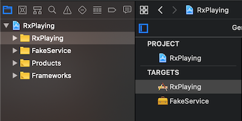
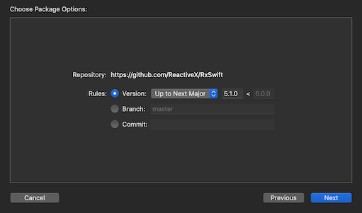
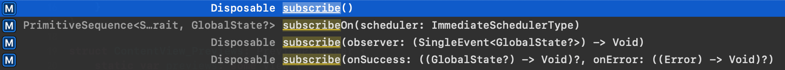

+++
title = "1. First Single endpoint"
date = 2020-03-15
+++
Learn the background story, explore the sample app and convert our first closure-driven endpoint to the Rx world by using a [Single](https://github.com/ReactiveX/RxSwift/blob/master/Documentation/Traits.md#single).

Feel free to use this link to skip all the parafernally of the post and dive directly into the code.  
➡️ **[Skip intro](#skip_intro)** ⬅️
<!-- more -->
# Background story
The key to a good product is a good story, it is true for presentations<sup>[1](#1)</sup>, commercials<sup>[2](#2)</sup> and even apps<sup>[3](#3)</sup>, so here is the one I came up with for this blog:

You recently joined a small mobile team in a medium company, this company is big enough to have processes and a little burocracy but not big enough to already have a mobile department. Their technology is a little old and most engineers are busy maintaining the core products, they also use a propietary network library (probably written in Objective-C and built on top of [ASIHTTPRequest](https://allseeing-i.com/ASIHTTPRequest/) so there is no way to modify it or use any cool network level feature.  
You will have to work with what you are given and it is rarely going to be ideal, well not ideal for you but ideal for me who control the plot. 😁

Anyway, the company is call _Thomson Brother's Division_ or TBD for short<sup>[4](#4)</sup>, they do a little of everything including logistics. In recent years they decided it was time to modernize and they plan to launch their fleet control system on the mobile world.  
<div align="center"><br><small>Logo created at <a href="https://www.freelogodesign.org/">Freelogodesign.org</a></small></div>

The CEO wants everything to be modern and shiny, they read somewhere (probably a newsletter) that React Native is the next big thing, they also found that Rx is a react framework available on both Android and iOS so the app has to be build using RxSwift (Yes I know ReactNative and Rx are different things but the CEO doesn't so 🤫).

<div align="center"></div>

That's where you enter, they hired you to build those mobile apps using RxSwift and SwiftUI but although you know some RxSwift you don't consider yourself an expert (otherwise you wouldn't be wasting you time here).
Someone already wrote a proof of concept app that was a success across the company directors and to "save time" you _have to_ build on top of that instead of starting from scratch like any sane human been would do<sup>[5](#5)</sup>.

### The app
The first app we need to build is the "Overview" app. Is an app where managers can see the current status of their distribution center.  
A distribution center has couriers and vehicles, clients make requests and packages are delivered from the distribution center to the client address, dependending of the distance the courier might go on foot or in a vehicle.
The App has to show:
1. A Map that shows the locations and status of:
   * Couriers
   * Vehicles
   * Clients (active)
   * The warehouse location

2. A tabbed section that shows list of the following elements and when selected display more details about them:
   * Couriers
   * Packages
   * Vehicles

 The POC only covers the map, we need to build the rest but on this episode we will only focus on the **Map** part.

### The Server
Sadly as this company has been running for a long time most of the core technology is old. The server is build on some very old and obsolete technology, something like Java… just teasing, it's build on COBOL and communicates back using CORBA and SOAP.<sup>[5](#5)</sup>.  

<div align="center"></div>

Luckily the guy who wrote the POC app is a backend engineer and created a ruby middleware that translates to JSON so we can use it. We don't care what the JSON looks like parsing server responses is not something we will cover on this episodes in detail we will just relay on the [FakeService framework](@/post_000.md#a-different-sample-app) to abstract from all that noise, anyway all this background story is to say that the server engineers are busy and you have to work with whatever endpoind you have.

||
|-|
# Work
### Goal {#skip_intro}
On this episode our goal is to add the RxSwift dependency into the PoC project and then rewrite the only endpoint we have to be more "Reactive".

### Code 
You will need Xcode 11.4 or newer.

You can download the sample apps from [here](https://github.com/Julioacarrettoni/playing-with-rxswift/tree/master/001), you should start working on the _before_ folder, at the end it should look like the _after_ folder.

Open the `RxPlaying.xcodeproj` project. You will notice it has two targets 
<div align="center"></div>
For simplicity I won't cover Unit testing on this episode and I removed the unit tests for the FakeService framework, but believe me, it has Unit tests, a lot of them 😬, no, really it does!

You can go ahead and run the RxPlaying target if you like, you can choose to run it on iOS or MacOS (if you are running Catalina) either will do although it will look better on iOS, everytime you run the application the same secuence will play. The map starts centered on the ficticious warehouse currently on the corner of Ellis and Stockton in San Francisco, then a client request a package near Pier 9 and Simon gets dispatched there on a car. 🚘  
The same JSON files (available inside the FakeService framework) are played over and over again, there is enough data for a little over 1 hour of activity for a total of 4 couriers, 2 vehicles and 17 packages being delivered to 13 different locations (some request more than one package)

<div align="center"></div>

If you checkout the views inside the RxPlaying target there are 2, [ContentView](https://github.com/Julioacarrettoni/playing-with-rxswift/blob/master/001/Before/RxPlaying/Views/ContentView.swift#L4) and [MapView](https://github.com/Julioacarrettoni/playing-with-rxswift/blob/master/001/Before/RxPlaying/Views/MapView.swift#L5), we will be ignoring the `MapView` for now, all it has is code to render the annotations on the map, animate them and a some boiler plate to communicate between UIKit and SwiftUI.

`ContentView` on the other hand is quite simple:
```Swift
struct ContentView: View {
    @State var globalState: GlobalState? = nil
    
    var body: some View {
        MapView(globalState: self.globalState)
            .edgesIgnoringSafeArea(.all)
            .onAppear(perform: self.refreshData)
    }
    
    private func refreshData() {
        Service.getSystemState() { globalState in
            self.globalState = globalState
            self.refreshData()
        }
    }
}
```
As soon as the `MapView` is rendered the app calls `Service.getSystemState` our only endpoint available for now, on the completion block the same method is called again, and again and again and again<sup>[5](#5)</sup>. "_If it is stupid but it works, it is still stupid._".  
This is what we want to improve with a little of Rx. So let's get started.

### Adding the dependency

We will be adding RxSwift as a Swift Package dependency, (you can read why on the [previous post](@/post_000.md#technology)), you can find some details on the RxSwift repository readme.md file ([here](https://github.com/ReactiveX/RxSwift#swift-package-manager)) but with the recent versions of Xcode it has gotten quite simple to do.  
Go to `Files`→`Swift Packages`→`Add Package Dependency…`
<div align="center"></div>

On the top of the page enter the URL to the RxSwift repo [https://github.com/ReactiveX/RxSwift](https://github.com/ReactiveX/RxSwift) and hit `Next`.  
<div align="center"></div>


On the next screen enter that we want to be using "Up to next mayor" and the version is `5.1.0` 
<div align="center"></div>

Now you have to select which of all the available frameworks we want, for now we will just use RxSwift.
<div align="center"></div>

And finally we are left on the `Swift Packages` tab for the project configuration, so as you can guess RxSwift is now available for all our targets.
<div align="center"></div>

I'm not goign to compare tools or advocate in favor of some or the others as this is not the point of the blog… but…  
**COME ON** that was super easy and straight forward!!! 😄

### Using RxSwift
Now is time to use RxSwift, let's modify the existing method that wrapps around FakeService framework, it's a struct with a single static method in `RxPlaying/Services/Service.swift`

```Swift
import FakeService
import Foundation

struct Service {
    static func getSystemState(completion: @escaping (GlobalState?) -> () ) {
        FakeServices.shared.getSystemState(completion: completion)
    }
}
```

First let's import RxSwift on top
```Swift
import FakeService
import Foundation
import RxSwift
```

For now let's add a new method instead of modifying the existing one so the rest of the app continues compiling.
```Swift
static func getSystemState() -> ???
```

Now, methods that takes no arguments and returns nothing don't seem too useful or they are full of those nasty side effects… , anyway, we need to return _something_ and `void` doesn't cut it today, (maybe later).  
What do we know? We know we are going to call an endpoint once and thus only get a single responce once. It doesn't get more easy than this, we need to return a [Single](https://github.com/ReactiveX/RxSwift/blob/master/Documentation/Traits.md#single).  

You reader have two options, you can:
1. Skip the following explanation by clicking 👉[here](#create_single)👈
2. Continue reading if you want to know a little more about [Single](https://github.com/ReactiveX/RxSwift/blob/master/Documentation/Traits.md#single). 🤓

The documentation on the github repo for RxSwift ([link](https://github.com/ReactiveX/RxSwift/blob/master/Documentation)) is quite good ❤️, I recommend starting there anytime you have a question, at the very least we will able to find some new words that can help you google.  
Now according to the docs, this is the way to create a [Single](https://github.com/ReactiveX/RxSwift/blob/master/Documentation/Traits.md#single):
```Swift
func getRepo(_ repo: String) -> Single<[String: Any]> {
    return Single<[String: Any]>.create { single in
        let task = URLSession.shared.dataTask(with: URL(string: "https://api.github.com/repos/\(repo)")!) { data, _, error in
            if let error = error {
                single(.error(error))
                return
            }

            guard let data = data,
                  let json = try? JSONSerialization.jsonObject(with: data, options: .mutableLeaves),
                  let result = json as? [String: Any] else {
                single(.error(DataError.cantParseJSON))
                return
            }

            single(.success(result))
        }

        task.resume()

        return Disposables.create { task.cancel() }
    }
}
```

Let's go step for step over this example, first let's remove some noise
```Swift
func getSomething(_ someValue: U) -> Single<T> {
    return Single<T>.create { single in
        someAsyncMethod(someValue) { _ in
            //We will cover this later
        }
        return Disposables.create { /* some cleaning */ }
    }
}
```
First it creates a [Single](https://github.com/ReactiveX/RxSwift/blob/master/Documentation/Traits.md#single) as required by the return type using the create method `Single<T>.create` that takes a closure as an argument, the nice thing about Rx is that it is open source and we can take a peek at how it works ([link](https://github.com/ReactiveX/RxSwift/blob/c6c0c540109678b96639c25e9c0ebe4a6d7a69a9/RxSwift/Traits/Single.swift#L37)) but sometimes it can be a little overwhelming. 😶 
```Swift
public static func create(subscribe: @escaping (@escaping SingleObserver) -> Disposable) -> Single<Element>
```

What you need to know is that this `create` method takes a [@escaping](https://docs.swift.org/swift-book/LanguageGuide/Closures.html#ID546) closure meaning that whatever it does will be done later (or maybe never).  

```Swift
@escaping (@escaping SingleObserver) -> Disposable
```

The closure is where we do our async work, the closure gives us another closure called [SingleObserver](https://github.com/ReactiveX/RxSwift/blob/70b8a33c5c3f4c3b15ebf10b638d2b15cfafb814/RxSwift/Traits/Single.swift#L27) that we can use to communicate back the result of our async task.  
It takes a single value, an enum [SingleEvent\<Element>](https://github.com/ReactiveX/RxSwift/blob/70b8a33c5c3f4c3b15ebf10b638d2b15cfafb814/RxSwift/Traits/Single.swift#L18) that can only take 2 values, `success` or `error`, yes, it is prety much a [Result type](https://developer.apple.com/documentation/swift/result).  
```Swift
public enum SingleEvent<Element> {
    /// One and only sequence element is produced.
    case success(Element)
    
    /// Sequence terminated with an error.
    case error(Swift.Error)
}
```

The closure has to return a [Disposable](https://github.com/ReactiveX/RxSwift/blob/53cd723d40d05177e790c8c34c36cec7092a6106/RxSwift/Disposable.swift) (Don't bother with the link there is not much there) The idea with disposables is that the consumer of this methods hold on to them for as long as they are interested in getting values out of the "RxThingy", when they are not longer interested they just throw away the disposable. 🚮  
The Disposable takes a closure that gets executed when the disposable "dies" or the "RxThingy" completes it's task, some of them never do as they are "infinite" but the single isn't.  
As you can see in the original example, the disposable calls `task.cancel()` to perform some clean up.
```Swift
return Disposables.create { task.cancel() }
```

You can create as many [Singles](https://github.com/ReactiveX/RxSwift/blob/master/Documentation/Traits.md#single) as you want and nothing will happen, is not until you "use" them that the closure is computed, also you can create only one [Single](https://github.com/ReactiveX/RxSwift/blob/master/Documentation/Traits.md#single) and "re-use" it multiple times, every time you "use" it the closure gets run again.  

To "use" a [Single](https://github.com/ReactiveX/RxSwift/blob/master/Documentation/Traits.md#single) or any other [ObservableType](https://github.com/ReactiveX/RxSwift/blob/c6c0c540109678b96639c25e9c0ebe4a6d7a69a9/RxSwift/ObservableType.swift#L10) you [subscribe](https://github.com/ReactiveX/RxSwift/blob/c6c0c540109678b96639c25e9c0ebe4a6d7a69a9/RxSwift/ObservableType.swift#L34) to it, this returns a [Disposable](https://github.com/ReactiveX/RxSwift/blob/53cd723d40d05177e790c8c34c36cec7092a6106/RxSwift/Disposable.swift) that you should hold onto or nothing will happen (and throw away when you no longer care about it), we will worry about this in a bit, let's go back to our example:
```Swift
func getSomething(_ someValue: U) -> Single<T> {
    return Single<T>.create { single in
        someAsyncMethod(someValue) { _ in
            //Is time to talk about this
        }
        return Disposables.create { /* some cleaning */ }
    }
}
```

Let's talk now about communicating results back to the [Single](https://github.com/ReactiveX/RxSwift/blob/master/Documentation/Traits.md#single), let's assume for simplicity that our async method can tells us if a number is prime or whatever, so it retuns `Bool`, if it fails it returns `nil` (Yes, this error management is top notch) and if it works it tells us either `true` or `false`, then our example would look like this replacing those `U` and `T`

```Swift
func isPrime(_ someValue: UInt) -> Single<Bool> {
    return Single<Bool>.create { single in
        someAsyncMethod(someValue) { response in
            //And now?
        }
        return Disposables.create() // There is nothing to clean.
    }
}
```

So the body of that closure could be something like this:  
If we have a boolean, we have a successful result and we tell that to the [SingleObserver](https://github.com/ReactiveX/RxSwift/blob/70b8a33c5c3f4c3b15ebf10b638d2b15cfafb814/RxSwift/Traits/Single.swift#L27) else it failed and we communicate that back:
```Swift
someAsyncMethod(someValue) { response in
    if let response = response {
        single(.success(response))
    } else {
        single(.error(SomeError.unknown))
    }
}
```
BTW `SomeError.unknown` is just a random enum I created so I could send it back:
```Swift
enum SomeError: Error {
    case unknown
}
```

Again, this is to keep the examples simple, so should do proper error handling on your codebase, or you know, just return the optional bool and let the consumer of the method deal with it 😜
```Swift
func isPrime(_ someValue: UInt) -> Single<Bool?> {
    return Single<Bool?>.create { single in
        someAsyncMethod(someValue) { response in
            single(.success(response)) // Everything is a success as our standars are low, like code quality.
        }
        return Disposables.create() // There is nothing to clean.
    }
}
```

But don't do this, dont be a bad person, the consumers of your APIs could be writting your performace review next quarter. 😬  
Also jokes aside we will be missing some cool functionality from Rx when we don't properly use it, for example the awesome `retry`. We will cover [Error handling](https://github.com/ReactiveX/RxSwift/blob/6b2a406b928cc7970874dcaed0ab18e7265e41ef/Documentation/GettingStarted.md#error-handling) gradually across the series alongside unit testing.

Now we have enough information to write our single.

### Let's create our single {#create_single}

We don't require arguments, and we expect out a `GlobalState?`
```Swift
static func getSystemState() -> Single<GlobalState?>
```

We then create the Single whose element is `<GlobalState?>`
```Swift
Single<GlobalState?>.create { single in
```

The "body" or task on our single is calling `FakeServices.shared.getSystemState(completion:)` and the way we handle errors (not the best way) is to just send back a nil if it fails, so any value is a success for us:
```Swift
FakeServices.shared.getSystemState { globalState in
    single(.success(globalState))
}
```

There is nothing to clean so the `Disposable` is simply
```Swift
return Disposables.create()
```

And all together it looks like this:
```Swift
static func getSystemState() -> Single<GlobalState?> {
    Single<GlobalState?>.create { single in
        FakeServices.shared.getSystemState { globalState in
            single(.success(globalState))
        }
          
        return Disposables.create()
    }
}
```

And we are **done**, we can call it a day, thank you for coming to my TedTalk, this is the end of the blog.

"_But, how do we use it?_" 🧐 you might ask. Ok, then maybe we are not done _yet_.

### Using the single
Let's use it on our [ContentView](https://github.com/Julioacarrettoni/playing-with-rxswift/blob/master/001/Before/RxPlaying/Views/ContentView.swift#L4), first things first, let's buckle those belts (American Airlines joke).
```Swift
import RxSwift
```

Let's emptu this method
```Swift
private func refreshData() {
}
```

And use our new Single:
```Swift
private func refreshData() {
    Service.getSystemState()
}
```

But as I said before, if we don't subscribe, nothing happens (besides that warning about unused result).  
When you try to subscribe you will that you have several options:
<div align="center"></div>

- The 1st one subscribes and lets the [Single](https://github.com/ReactiveX/RxSwift/blob/master/Documentation/Traits.md#single) run and do it's thing but when we don't particularly care about the result.  
- The 2nd one let's you subscribe on a specific scheduler, this is not about a particular thread, or queue, it's bigger than that, you can read more on the aweseome ❤️[docs](https://github.com/ReactiveX/RxSwift/blob/70b8a33c5c3f4c3b15ebf10b638d2b15cfafb814/Documentation/Schedulers.md)❤️ we will revisit those later (very later) in this blog, for now all we need to know is:  
> In case it isn't explicitly specified, work will be performed on whichever thread/scheduler elements are generated.  
- The 3rd gives you one closure with the result of the single as the enum [SingleEvent](https://github.com/ReactiveX/RxSwift/blob/70b8a33c5c3f4c3b15ebf10b638d2b15cfafb814/RxSwift/Traits/Single.swift#L18), so you can `switch` on it and do what you want all in a single place.
- The 4th one gives you 2 closures, one with the value and one with the error, only one of those will be called, but this way you don't have to `switch` over the result and can have the reaction to each case separated, or even ignore one.

Which one should we use? Well, the 1st one is useless for us _right now_, 2nd one is too advanced, 3rd one looks nice, but to be honest we are doing some very lousy error handling so far and we don't care about handling the error scenario, so the 4th one it is!

```Swift
private func refreshData() {
    Service.getSystemState().subscribe(onSuccess: { globalState in
        // Something
    }) { error in
        // Error handling
    }
}
```

I **said** we don't care about error handling because we are lousy developers.

```Swift
private func refreshData() {
    Service.getSystemState().subscribe(onSuccess: { globalState in
        // Something
    })
}
```

Almost there, we have forgotten to grab onto the disposable, if we don't nothing will happens, besides the useful compile warning that is also properly documented on the ❤️[docs](https://github.com/ReactiveX/RxSwift/blob/70b8a33c5c3f4c3b15ebf10b638d2b15cfafb814/Documentation/Warnings.md)❤️ but again it could be a little ovrwhelming so **TL;DR** version, we just grab all those disposables and thrown them into a bag, we tied the lifetime of the bag to something that makes sense like our `View` and we can't forget about it. If we leave this page the `View` gets deallocated, that kills the bad and the bag in turn kills all the disposables on it and they do the cleanup on their last breath. ☠️  

Sometimes you want to have more control, for example you want to stop any pending request when transitioning to a new screen, in that case just throw the bag away.  
It is also normal to have different bags at the same time so you can have more granular control over the lifetime of different disposables by adding them to different bags, this is perfectly fine although probably there are better ways to handle those cases in more _reactive_ ways (pun intended), we will talk more about this in future episodes when we get to some nicely complicated examples 😉.   

Anyways, back on topic. Let's add a local atribute to our view
```Swift
let disposeBag = DisposeBag()
```
And then lets toss the disposable into the bag.

```Swift
private func refreshData() {
    Service.getSystemState().subscribe(onSuccess: { globalState in
        // Something
    }).disposed(by: self.disposeBag)
}
```

Let's pause for a moment and let's talk about coding styles 👩‍🎨 If you have been looking at the [RxSwift](https://github.com/ReactiveX/RxSwift) documentation you might have notice a particular style, everything is in a new line. That's to make things easier to read, it doesn't look like much right now, but believe me the moment we start piling operators it will become obvious.  

Let's rewrite
```Swift
private func refreshData() {
    Service.getSystemState()
        .subscribe(onSuccess: { globalState in
            // Something
        })
        .disposed(by: self.disposeBag)
}
```

Let's do something with the response, basically what we were doing before:
```Swift
private func refreshData() {
    Service.getSystemState()
        .subscribe(onSuccess: { globalState in
            self.globalState = globalState
            self.refreshData()
        })
        .disposed(by: self.disposeBag)
}
```
- "_Aren't you forgetting to use `[weak self]`?_" 🤔  
- Well, no, views are structs.
- "_But if views are structs, then when the state changes and the view gets recreated the `disposeBag` get recreated and everything is disposed so…_" 🤔  
- Let's not overthink too much nor get ahead of ourselves… we will eventually get to that. 😅

Now you can run the app again and notice that everything still works. 🎉
Now we are done and we can end this episode
- "_Aren't you supposed to do a summary or conclusion or something like that?_" 🤔  

**FINE** 😒

## Conclusions

### Bonus track

##### Footnotes
<a id='1'>1</a>: [Theguardian.com](https://www.theguardian.com/small-business-network/2017/feb/16/master-art-presenting-tell-story-brief-audience) The guardian: "_Master the art of presenting: tell a story, keep it brief_"  
<a id='2'>2</a>: [Lucidpress.com](https://www.lucidpress.com/blog/how-airbnb-and-apple-use-storytelling-marketing-to-build-their-brands) "_How Airbnb and Apple build their brands with storytelling marketing_"  
<a id='3'>3</a>: [Enricoangelini.com](https://enricoangelini.com/2011/ios-5-tech-talk-world-tour-in-rome/) look for "_iPhone and iPad User Interface Design_"  
<a id='4'>4</a>: Yes, that was a joke and that's one of the good ones, so brace yourself.  
<a id='5'>5</a>: If this story hits close to home, please accept my condolences.