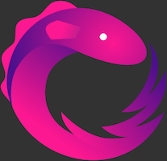
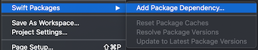

+++
title = "1. First endpoint"
date = 2020-03-15
+++
Learn the background story, explore the sample app and convert our first closure-driven endpoint to the Rx world

Feel free to use this link to skip all the parafernally of the post and dive directly into the code.  
➡️ **[Skip intro](#skip_intro)** ⬅️
<!-- more -->
# Background story
The key to a good product is a good story, it is true for presentations<sup>[1](#1)</sup>, commercials<sup>[2](#2)</sup> and even apps<sup>[3](#3)</sup>, so here is the one I came up with for this blog:

You recently joined a small mobile team in a medium company, this company is big enough to have processes and a little burocracy but not big enough to already have a mobile department. Their technology is a little old and most engineers are busy maintaining the core products, so you will have to work with what you are given and it is rarely going to be ideal, well not ideal for you but ideal for me who control the plot. 😁

Anyway, the company is call _Thomson Brother's Division_ or TBD for short<sup>[4](#4)</sup>, they do a little of everything including logistics. In recent years they decided it was time to modernize and they plan to launch their fleet control system on the mobile world.  
<div align="center"><br><small>Logo created at <a href="https://www.freelogodesign.org/">Freelogodesign.org</a></small></div>

The CEO wants everything to be modern and shiny, they read somewhere (probably a newsletter) that React Native is the next big thing, they also found that Rx is a react framework available on both Android and iOS so the app has to be build using RxSwift (Yes I know ReactNative and Rx are different things but the CEO doesn't so 🤫).

<div align="center"></div>

That's where you enter, they hired you to build those mobile apps using RxSwift and SwiftUI but although you know some RxSwift you don't consider yourself an expert (otherwise you wouldn't be wasting you time here).
Someone already wrote a proof of concept app that was a success across the company directors and to "save time" you _have to_ build on top of that instead of starting from scratch like any sane human been would do<sup>[5](#5)</sup>.

### The app
The first app we need to build is the "Overview" app. Is an app where managers can see the current status of their distribution center.  
A distribution center has couriers and vehicles, clients make requests and packages are delivered from the distribution center to the client address, dependending of the distance the courier might go on foot or in a vehicle.
The App has to show:
1. A Map that shows the locations and status of:
   * Couriers
   * Vehicles
   * Clients (active)
   * The warehouse location

2. A tabbed section that shows list of the following elements and when selected display more details about them:
   * Couriers
   * Packages
   * Vehicles

 The POC only covers the map, we need to build the rest but on this episode we will only focus on the **Map** part.

### The Server
Sadly as this company has been running for a long time most of the core technology is old. The server is build on some very old and obsolete technology, something like Java… just teasing, it's build on COBOL and communicates back using CORBA and SOAP.<sup>[5](#5)</sup>.  

<div align="center"></div>

Luckily the guy who wrote the POC app is a backend engineer and created a ruby middleware that translates to JSON so we can use it. We don't care what the JSON looks like parsing server responses is not something we will cover on this episodes in detail we will just relay on the [FakeService framework](@/post_000.md#a-different-sample-app) to abstract from all that noise, anyway all this background story is to say that the server engineers are busy and you have to work with whatever endpoind you have.

||
|-|
# Work
### Goal {#skip_intro}
On this episode our goal is to add the RxSwift dependency into the PoC project and then rewrite the only endpoint we have to be more "Reactive".

### Code 
You will need Xcode 11.4 or newer.

You can download the sample apps from [here](https://github.com/Julioacarrettoni/playing-with-rxswift/tree/master/001), you should start working on the _before_ folder, at the end it should look like the _after_ folder.

Open the `RxPlaying.xcodeproj` project. You will notice it has two targets 
<div align="center"></div>
For simplicity I won't cover Unit testing on this episode and I removed the unit tests for the FakeService framework, but believe me, it has Unit tests, a lot of them 😬, no, really it does!

You can go ahead and run the RxPlaying target if you like, you can choose to run it on iOS or MacOS (if you are running Catalina) either will do although it will look better on iOS, everytime you run the application the same secuence will play. The map starts centered on the ficticious warehouse currently on the corner of Ellis and Stockton in San Francisco, then a client request a package near Pier 9 and Simon gets dispatched there on a car.  
The same JSON files (available inside the FakeService framework) are played over and over again, there is enough data for a little over 1 hour of activity for a total of 4 couriers, 2 vehicles and 17 packages being delivered to 13 different locations (some request more than one package)

<div align="center"></div>

If you checkout the views inside the RxPlaying target there are 2, `ContentView` and `MapView`, we will be ignoring the `MapView` for now, all it has is code to render the annotations on the map, animate them and a some boiler plate to communicate between UIKit and SwiftUI.

`ContentView` on the other hand is quite simple:
```Swift
struct ContentView: View {
    @State var globalState: GlobalState? = nil
    
    var body: some View {
        MapView(globalState: self.globalState)
            .edgesIgnoringSafeArea(.all)
            .onAppear(perform: self.refreshData)
    }
    
    private func refreshData() {
        Service.getSystemState() { globalState in
            self.globalState = globalState
            self.refreshData()
        }
    }
}
```
As soon as the `MapView` is rendered the app calls `Service.getSystemState` our only endpoint available for now, on the completion block the same method is called again, and again and again and again<sup>[5](#5)</sup>. "_If it is stupid but it works, it is still stupid._".  
This is what we want to improve with a little of Rx. So let's get started.

### Adding the dependency

We will be adding RxSwift as a Swift Package dependency, (you can read why on the [previous post](@/post_000.md#technology)), you can find some details on the RxSwift repository readme.md file ([here](https://github.com/ReactiveX/RxSwift#swift-package-manager)) but with the recent versions of Xcode it has gotten quite simple to do.  
Go to `Files`→`Swift Packages`→`Add Package Dependency…`
<div align="center"></div>

On the top of the page enter the URL to the RxSwift repo [https://github.com/ReactiveX/RxSwift](https://github.com/ReactiveX/RxSwift) and hit `Next`.  
<div align="center"></div>


On the next screen enter that we want to be using "Up to next mayor" and the version is `5.1.0` 
<div align="center"></div>

Now you have to select which of all the available frameworks we want, for now we will just use RxSwift.
<div align="center"></div>

And finally we are left on the `Swift Packages` tab for the project configuration, so as you can guess RxSwift is now available for all our targets.
<div align="center"></div>

### Using RxSwift
Now is time to use RxSwift, let's modify the existing method that wrapps around FakeService framework, it's a struct with a single static method in `RxPlaying/Services/Service.swift`

```Swift
import FakeService
import Foundation

struct Service {
    static func getSystemState(completion: @escaping (GlobalState?) -> () ) {
        FakeServices.shared.getSystemState(completion: completion)
    }
}
```

First let's import RxSwift on top
```Swift
import FakeService
import Foundation
import RxSwift
```

Now let's add a new method so the rest of the app continues compiling
```Swift

```

##### Footnotes
<a id='1'>1</a>: [Theguardian.com](https://www.theguardian.com/small-business-network/2017/feb/16/master-art-presenting-tell-story-brief-audience) The guardian: "_Master the art of presenting: tell a story, keep it brief_"  
<a id='2'>2</a>: [Lucidpress.com](https://www.lucidpress.com/blog/how-airbnb-and-apple-use-storytelling-marketing-to-build-their-brands) "_How Airbnb and Apple build their brands with storytelling marketing_"  
<a id='3'>3</a>: [Enricoangelini.com](https://enricoangelini.com/2011/ios-5-tech-talk-world-tour-in-rome/) look for "_iPhone and iPad User Interface Design_"  
<a id='4'>4</a>: Yes, that was a joke and that's one of the good ones, so brace yourself.  
<a id='5'>5</a>: If this story hits close to home, please accept my condolences.  {#5}