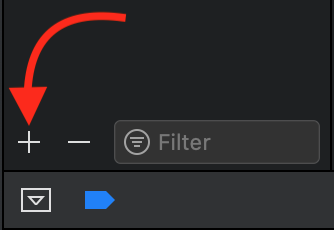

+++
title = "2. The Single sad path 🐞"
date = 2020-03-15
+++
Now that the endpoint is wrapped in a [Single](https://github.com/ReactiveX/RxSwift/blob/master/Documentation/Traits.md#single) and works nicely on the "happy path". It's time to start working on handling those error scenarios and add some unit tests to try to catch future bugs before they even happen.

**[Skip intro](#skip_intro)**
<!-- more -->
# Background story
Thomson Brothers Division might be a medium company with some old technological stack, but that doesn't mean they do things wrong. The company has some modern processes in place to ensure a minimum level of code quality.  
For example, they do Agile software development<sup>[1](#1)</sup>. Probably someone read a fancy post on LinkedIn selling Agile facilitation consulting and though: "_This looks nice, and I don't need to pay someone to tell me how to run my team. I'll simply follow the first 3 chapters of this book, most of it doesn't apply to us anyway_" <sup>[2](#2)</sup>. And just like that, "_Agile TBD development process_" was born (pun intended).  
They should have hired the consultant. It would have been cheaper in the long run…  

Anyway, as a result to that, one thing led to another, and the company ended up adopting and _adapting_ _"git flow"_<sup>[3](#3)</sup>, so now you have to create a "_pull request_"<sup>[4](#4)</sup> into the master branch from your refactor branch.  
By following the company docs, you have to complete a checklist in the description of your pull request, some of which are:
- Considers edge cases and non-happy paths
- Handle errors
  - Recover from errors gracefully
  - Logs errors.
- Introduces new unit tests

Without this, the pull request will be rejected.

In the previous post, I intentionally avoided those for the sake of simplicity as it was getting a little too long. Now is time to pay the debt.  
Not every pull request has to introduce new unit tests, as I said on the previous post, there was not much to test as it was a refactor, now that we are about to improve the error handling and the user experience that might change.

||
|-|
# Work {#skip_intro}
### Goal
Fix any issues (bugs, bad user experience) the app might have when working under non-ideal conditions by completing each of the items in this list:
- Considers edge cases and non-happy paths
- Handle errors
  - Recover from errors gracefully
  - Log errors.
- Introduces new unit tests
&nbsp;  
&nbsp;  
&nbsp;  
### Code
You will need Xcode 11.4 or newer.

You can download the sample apps from [here](https://github.com/Julioacarrettoni/playing-with-rxswift/tree/master/002), you should start working on the _before_ folder, in the end, it should look like the _after_ folder.
&nbsp;  
&nbsp;  
&nbsp;  
#### Considers edge cases and non-happy paths

Open the `RxPlaying.xcodeproj` project. The RxPlaying targets have no changes from the previous post, but the FakeService framework has received some small updates for this post, in particular, the [Environment](https://github.com/Julioacarrettoni/playing-with-rxswift/blob/master/002/Before/FakeService/FakeServices.swift#L3-L11) struct received a new member:
```Swift
public var failNext: () -> Bool
```
Returning `true` in this closure makes the next request fail. Right now, there is no granular control on any of the closures as we only have a single endpoint, and I want to keep things simple.  
We will use this to simulate bad networks when combined with the existing `delay` member.  
In real life advanced network stacks provide with mock functionality else you can always simulate bad network conditions on your iPhone or your simulator without having to turn airplane mode on or turning off the Wi-Fi, [here](https://www.natashatherobot.com/simulate-bad-network-ios-simulator/) is a nice post by [NatashaTheRobot](https://twitter.com/natashatherobot) for reference.

Add this method anywhere on [Service.swift](https://github.com/Julioacarrettoni/playing-with-rxswift/blob/master/002/Before/RxPlaying/Services/Service.swift#L5) inside the `Service` struct.
```Swift
static func overrideNetworkMock() {
    var failures = [false, true]
    FakeService.Current.failNext = {
        let next = failures.removeFirst()
        failures.append(next)
        return next
    }
}
```
Every time the closure gets invoked we return the first value on the `failures` array and push it to the back. It cycles through all the values of the array.

Now we need to call this method once, a right place could be [here](https://github.com/Julioacarrettoni/playing-with-rxswift/blob/master/002/Before/RxPlaying/SceneDelegate.swift#L12) in the `SceneDelegate.swift` file.

If you run the app half the requests will "fail" and it will look like this:
<div align="center"></div>

Every time the request fails a `nil` is returned and blindly forwarded to the `MapView` View
```Swift
.subscribe(onSuccess: { globalState in
    self.globalState = globalState
    self.refreshData()
})
```

The internal implementation of the `MapView` tries to animate annotation transitions. It fades out annotations that are removed and fades in annotations that are added. As a result, it fades out all annotations when the request fails as we are removing all of them by setting a `globalState` with `nil` value, and then it fades in all the annotations when a new value of `globalState` is received.

We can "patch" this issue in several places, starting with the bug on the `MapView` when fading in annotations due to view recycling, but in the meantime, we will ignore that as is not our main concern.  
We can be tempted to do something like:
```Swift
.subscribe(onSuccess: { globalState in
    if let globalState = globalState {
        self.globalState = globalState
    }

    self.refreshData()
})
```
And that will certainly fix the issue, but the proper "fix" is to start doing some real error handling and separating concerns.  
We will see soon that this not only fixes the problem but also enables us to do more while keeping everything clean and separated.
&nbsp;  
&nbsp;  
&nbsp;  
#### Handle errors, recover from errors gracefully

Let's take a look back at our current implementation of the "reactive" endpoint:
```Swift
static func getSystemState() -> Single<GlobalState?> {
    Single<GlobalState?>.create { single in
        FakeServices.shared.getSystemState { globalState in
            single(.success(globalState))
        }
        
        return Disposables.create()
    }
}
```

To be honest, `FakeService` doesn't really help us as it doesn't return any error, is just return a value or `nil`<sup>[2](#2)</sup>, I hope that whatever network stack you have at work in real life is a little more cooperative than this one 😁.

Let's concentrate on the "body" of our Single:
```Swift
FakeServices.shared.getSystemState { globalState in
    single(.success(globalState))
}
```

We want to only return `.success` if we have a value, an error otherwise.
```Swift
FakeServices.shared.getSystemState { globalState in
    if let globalState = globalState {
        single(.success(globalState))
    } else {
        single(.error( ?????????????? ))
    }
}
```

Ok, we need an error first, let's start by creating one inside `Service.swift`, an easy way is to use an `enum` with lots of clear cases and some `vars` for stuff like description, analytics, etc., but again we don't have much to work with given the current state of `FakeService`, this is as far as we can go (for now).
```Swift
enum GetSystemStateError: Error {
    case unknown
}
```

Now the end result for the body is:

```Swift
FakeServices.shared.getSystemState { globalState in
    if let globalState = globalState {
        single(.success(globalState))
    } else {
        single(.error(GetSystemStateError.unknown))
    }
}
```

Let's look at it, it is still easy to read and descriptive, plus now it is explicit that not getting a value from `FakeServices.shared.getSystemState` is considered an error.  
Furthermore we can now change the whole method and get ride of the optionals:
```Swift
static func getSystemState() -> Single<GlobalState> {
    Single<GlobalState>.create { single in
        // Body
    }
}
```

This simplifies `ContentView` as we no longer have to wonder what does it means for the Single to return a `nil`.

If we run the app now, it won't blink anymore, but also it won't do anything else that rendering a single service call.  
The problem is that our current precarious polling system relies on `ContentView.refreshData` to call itself at the end and when it fails it doesn't retry as we are not currently handling the error cases.  
Let's take a look at it:
```Swift
private func refreshData() {
    Service.getSystemState()
        .subscribe(onSuccess: { globalState in
            self.globalState = globalState
            self.refreshData()
        })
        .disposed(by: self.disposeBag)
}
```

The subscribe method has another argument that we are currently ignoring in our naive usage of the reactive API, `onError`, let's use it:
```Swift
Service.systemSingle
    .subscribe(onSuccess: { globalState in
        self.globalState = globalState
        self.refreshData()
    }, onError: { _ in
        self.refreshData()
    })
    .disposed(by: self.disposeBag)
```

Now, if you run the application, it will look lovely as before, even if every other request fails, furthermore we have a decent separation between the happy path and the sad path. As a reminder, we have different `subscribe` options that were discussed in the previous post [here](/post-001#subscribe_section).

Now it seems we have covered the "handle errors gracefully" section, **spoiler alert**, we haven't, what we won't notice until a little later in the post.
&nbsp;  
&nbsp;  

||
|-|
### Intermission
[Skip intermission](#skip_intermission)  
Before continuing talking about logging and testability, there is something I would like to show you, on the previous post I mentioned that we can re-use the same single multiple times ([here](/post-001#multiple)), so why use a method? Why are we re-creating the same Instance over an over again? I mean is not like is a huge performance boost, plus "_[…] premature optimization is the root of all evil (or at least most of it) in programming._"<sup>[5](#5)</sup> Donald Knuth.  
Still, this is the right thing to do plus 0.001% over time compounds and 🦆 our application's performance.  
What we can do is to use a static variable we only create once:
```Swift
static var systemSingle: Single<GlobalState> = {
    Single<GlobalState>.create { single in
        // Body
        return Disposables.create()
    }
}()
```

That we can reuse directly:
```Swift
private func refreshData() {
    Service.systemSingle
        .subscribe(onSuccess: { globalState in
            // Body
        )
        .disposed(by: self.disposeBag)
}
```

If you don't believe me (I don't blame you, and you shouldn't trust me to be honest), you can try it yourself and add a print line here (and also a `return`)
```Swift
static var systemSingle: Single<GlobalState> = {
    print("Creating the single one single time.")
    return Single<GlobalState>.create { single in
```

Now the app works just as before, and we just gained little performance boost… maybe?.

Now back to our regular programing...
&nbsp;  
&nbsp;  

||
|-|
#### Handle errors, Log errors. {#skip_intermission}

Let's log some errors on the client, for simplicity our logs will be just printing to the console AKA "poor man's debugger".  
An straight forward change could be:
```Swift
onError: { error in
    print("[\(#function)] ❌ request error: \(error)")
    self.refreshData()
})
```

Right now this feels like enough as we only use the endpoint in a single place, but it would be good to have the logging at the endpoint level too, then we can see how often and endpoint fails and also if we use it in different parts of our app which one is more affected.

We might be tempted to modify the body of our single and log the error in the same place where we are creating it:
```Swift
FakeServices.shared.getSystemState { globalState in
    if let globalState = globalState {
        single(.success(globalState))
    } else {
        // Not good enough 
        let error = GetSystemStateError.unknown
        print("[\(#function)] ❌ request error: \(error)")
        single(.error(error))
    }
}
```

But there is a better way, the RxWay. All observables have a handy operator called [do](https://github.com/ReactiveX/RxSwift/blob/70b8a33c5c3f4c3b15ebf10b638d2b15cfafb814/RxSwift/Traits/Single.swift#L157-L170), and this one is a big one:
> Invokes an action for each event in the observable sequence, and propagates all observer messages through the result sequence.  
>
> see also: [do operator on reactivex.io](http://reactivex.io/documentation/operators/do.html)  
>
> · **onSuccess**: Action to invoke for each element in the observable sequence.  
> · **afterSuccess**: Action to invoke for each element after the observable has passed an onNext event along to its downstream.  
> · **onError**: Action to invoke upon errored termination of the observable sequence.  
> · **afterError**: Action to invoke after errored termination of the observable sequence.  
> · **onSubscribe**: Action to invoke before subscribing to source observable sequence.  
> · **onSubscribed**: Action to invoke after subscribing to source observable sequence.  
> · **onDispose**: Action to invoke after subscription to source observable has been disposed for any reason. It can be either because sequence terminates for some reason or observer subscription being disposed.  
>
> **returns**: The source sequence with the side-effecting behavior applied.  

This operator should not be confused with [map](https://github.com/ReactiveX/RxSwift/blob/70b8a33c5c3f4c3b15ebf10b638d2b15cfafb814/RxSwift/Traits/Single.swift#L203-L208) or any of its variants as this method does not modify the stream in any way, that's what "_[…]and propagates all observer messages through the result sequence_" means. Also, as you can see, it has a lot of options to "hook into", this makes [do](https://github.com/ReactiveX/RxSwift/blob/70b8a33c5c3f4c3b15ebf10b638d2b15cfafb814/RxSwift/Traits/Single.swift#L157-L170) great for logging and also debugging your code, by the way, there is a [debug](https://github.com/ReactiveX/RxSwift/blob/6b2a406b928cc7970874dcaed0ab18e7265e41ef/RxSwift/Observables/Debug.swift#L23) operator as well.

Now we can add this at the end of our Single definition, and we will be effortlessly "logging" all results from it no matter where we use it.

```Swift
.do(onSuccess: { _ in
    print("[\(#function)] ✅ Success")
}, onError: { error in
    print("[\(#function)] ❌ request error: \(error)")
})
```

This is the output of the console now:  
> [Service] ✅ Success  
[Service] ❌ request error: unknown  
[refreshData()] ❌ request error: unknown  
[Service] ✅ Success  
[Service] ❌ request error: unknown  
[refreshData()] ❌ request error: unknown  
[Service] ✅ Success  
[Service] ❌ request error: unknown  
[refreshData()] ❌ request error: unknown  

We can also go back to `ContentView` and add a [do](https://github.com/ReactiveX/RxSwift/blob/70b8a33c5c3f4c3b15ebf10b638d2b15cfafb814/RxSwift/Traits/Single.swift#L157-L170) there so we can separate logging from business logic like this:

```Swift
private func refreshData() {
    Service.systemSingle
➡️      .do(onError: { error in
➡️          print("[\(#function)] ❌ request error: \(error)")
➡️      })                                                    
        .subscribe(onSuccess: { globalState in
            self.globalState = globalState
            self.refreshData()
        }, onError: { error in
            self.refreshData()
        })
        .disposed(by: self.disposeBag)
}
```

If we found ourselves writing the same [do](https://github.com/ReactiveX/RxSwift/blob/70b8a33c5c3f4c3b15ebf10b638d2b15cfafb814/RxSwift/Traits/Single.swift#L157-L170) to log over and over again we might as well extend `PrimitiveSequenceType` and add our on log function, so our call site looks cleaner:
```Swift
private func refreshData() {
    Service.systemSingle
➡️      .logErrors()
        .subscribe(onSuccess: { globalState in
            self.globalState = globalState
            self.refreshData()
        }, onError: { error in
            self.refreshData()
        })
        .disposed(by: self.disposeBag)
}
```

That's up to you. I won't do it to keep the code as vanilla as possible to avoid confusion.  
And with that, we saw how easy it is to add logs to our system while still retaining some separation between business logic and logs/analytics.  

&nbsp;  
&nbsp;  

||
|-|
#### Introduces new unit tests
It's time to add some unit tests, the question now is "_What should we test?_" The more tests we write, the better, but writing tests just for the sake of it is not good.  
Anyway, let's check the changes we introduced and what should we test. I personally like to use the tests to document my assumptions, so if at any time one of those assumptions change the test will warn all of us that something might break, you have the draw the line somewhere though, for example, I'm going to assume that RxSwift is stable and tested enough, so I don't have to verify stuff like a [do](https://github.com/ReactiveX/RxSwift/blob/70b8a33c5c3f4c3b15ebf10b638d2b15cfafb814/RxSwift/Traits/Single.swift#L157-L170) always propagates events down the line.  

We haven't made to many changes though, we removed the requirement of the optional (the compiler takes care of ensuring that) and introduced a new error, but our logic doesn't even care what kind of error we get, so can we say that there isn't anything worth testing?  
Let's look closer, we did make an assumption, and a big one, we are assuming that the single will always send back an event, either an element or an error.  
Someone could, by mistake remove the line that emits the error:
```Swift
FakeServices.shared.getSystemState { globalState in
    if let globalState = globalState {
        single(.success(globalState))
    } else {
➡️      single(.error(GetSystemStateError.unknown))
    }
}
```
No, I'm not being **too** far fetched or pessimist, you think it is impossible for someone to come and remove that crucial line, well in this context it seems highly unlikely given the simplicity of the program. Still, even on the most simple logics someone making a big refactor and solving a rebase with lots conflicts might get confused and solve it the wrong way, it can happen (I have seen it MANY times) and if this situation happens it would be terrible as neither of the logs we have will catch it.  

So first things first, we need to create a new target on the project for our tests, you can google that out, but here is a simple recap:
1. Select the project on the file navigator tab.
2. Click the + button to add a new target.
3. Select the unit test template (The default values are more than fine).
<div align="center"></div>

Now find the `RxPlayingTests.swift` file, get rid of the `testPerformanceExample` function as we won't use it and rename `testExample` to something more representative, but remember it has to always be prefixed with the word `test`, take no arguments and return void<sup>[6](#6)</sup>. I'm awful at naming things (Take the blog or the fake company as good examples), but a convention is `what-is-being-tested`+`the-state-change`+`expected-value` so maybe `testSystemSingleWhenFailsReturnsError` is a proper name.

```Swift
func testSystemSingleWhenFailsReturnsError() throws {
    // This is an example of a functional test case.
    // Use XCTAssert and related functions to verify your tests produce the correct results.
}
```

And now what?  

First, let's import the Target we want to test with the `@testable` attribute<sup>[7](#7)</sup>, so we have access to its internal members and also the FakeService module as we will use it.
```Swift
@testable import RxPlaying
import FakeService
```

In real life we would need to introduce some dependency injection mechanism so we can switch the FakeService with a MockService we can control and force it to return `nil` on-demand and avoid making network calls, unit tests that make network calls are not unit tests, no matter what arguments you use they are all wrong to me. Luckily to us, FakeService comes with a mocking mechanism (is a Mock after all).    

So let's setup our tests on `setUpWithError` by setting the delay to `0` as that's something we want for all our tests.  
```Swift
override func setUpWithError() throws {
    FakeService.Current.delay =  { 0 }
}
```

And let's make all request fail at the beginning of our test since that's the condition we want to test
```Swift
func testSystemSingleWhenFailsReturnsError() throws {
    FakeService.Current.failNext = { true }

}
```

Now we are ready to test, we need to subscribe to `Service.systemSingle`, as we are only interested in testing if we get an error we select the version of subscribe that has `onSuccess:onError:`, (You can refresh this topic [here](/post-001#subscribe_section))  
Again we are only interested in the error so we can ignore the `onSuccess:`.  
If on error gets call then the test passes, we trigger that with `XCTAssert(true)`.

```Swift
Service.systemSingle
    .subscribe(onError: { _ in
        XCTAssert(true) // If we hit this line we are good!
})
```

If you run your test, it passes! 🎉 So are we done?  

**No**

Rule number #1 when writing tests is "_Tests that your tests fail._"  
Tests are build to fail, and you HAVE to make sure they fail at least when you expect them to fail; otherwise, the test is pointless. (Also that code if you are following the post on your Xcode that code is emitting warnings, so there is something fishy with it, to say the least)
Let's change the `failNext` closure, so requests don't fail, that should make the test fail.
```Swift
FakeService.Current.failNext = { false }
```

But if we rerun the test, it won't fail.

You can play putting breakpoints and check that when `failNext` is set to `true`, our `XCTAssert(true)` is indeed executed, but when `failNext` is set to `false` it is not, so why is the test passing? Easy, if it doesn't fail, it passes. Tests are intended to check for failure conditions. That's why we have `XCTFail()` but not `XCTSuccess()` method.  

One could be tempted to change the test to this so you can indeed test the failure scenarios:
```Swift
Service.systemSingle
    .subscribe(onSuccess: { _ in XCTFail() })
```
And if you are lucky enough, your test may pass, but it won't always, there is a race condition, and you might end up with an exception "_Parameter "test" must not be nil._" which basically happens when a test fails after it had finished running.  
The nature of the system we are testing is asynchronous, and we should test it properly, for that we will use expectations<sup>[8](#8)</sup>.  
Expectations are easy to use, you create one, on an asynchronous task you set it to "fulfilled", and then you "pause" the execution of the test using a [XCTWaiter](https://developer.apple.com/documentation/xctest/xctwaiter) and a timeout, if the expectation is not fulfilled before the time passes the test fail.  
As `XCTestCase` conforms to the [XCTWaiterDelegate](https://developer.apple.com/documentation/xctest/xctwaiterdelegate), we can just do `self.wait`.  
Here is the code:
 ```Swift
 func testSystemSingleWhenFailsReturnsError() throws {
    FakeService.Current.failNext = { true }
    
    let expectation = XCTestExpectation(description: "We get an error if the request fails")
    
    Service.systemSingle
        .subscribe(onError: { _ in
            expectation.fulfill()
        })
    
    self.wait(for: [expectation], timeout: 0.1)
}
 ```

If you run the test, it will pass, and if you flip the value of `failNext` it fails with a glorious: `_Asynchronous wait failed: Exceeded timeout of 0.1 seconds, with unfulfilled expectations: "We get an error if the request fails"._`  

Let's improve the test a little, first, let's fix the warning by creating a dispose bag and retaining the returned value of `susbcribe`. In this case, we can do it locally as the `wait` will hold the execution, and the current scope won't end before time disposing of our bag, and it's content.  

 ```Swift
func testSystemSingleWhenFailsReturnsError() throws {
    FakeService.Current.failNext = { true }
    
    let expectation = XCTestExpectation(description: "We get an error if the request fails")
    
    let disposeBag = Service.systemSingle
        .subscribe(onError: { _ in
            expectation.fulfill()
        })
    
    self.wait(for: [expectation], timeout: 0.1)
    disposeBag.dispose()
}
 ```

Also, it is a good idea to "fail fast", it doesn't look like much, but if this test fails, it fails after 0.1 seconds, if you have 10 tests failing that's at least 1 second of extra delay, if you have hundreds, the test suit could be delayed a lot when there is a change breaking multiple tests and running CI costs money baby.  
So let's also fail fast by failing if the `onSuccess:` closure ever gets hit.
 ```Swift
.subscribe(onSuccess: { _ in
    XCTFail()
}, onError: { _ in
    expectation.fulfill()
})
 ```

But if you followed my advice and verified that the test fails when it should you would have noticed it failed because of the time up, not because of the timeout and not because of the `XCTFail()` even when that lines get hit (go on put a breakpoint and try), that's because there is something _not_ right with `XCTestCase` so we should use [XCTWaiter](https://developer.apple.com/documentation/xctest/xctwaiter) directly, now the final version of the test looks like this:
```Swift
func testSystemSingleWhenFailsReturnsError() throws {
    FakeService.Current.failNext = { true }
    
    let expectation = XCTestExpectation(description: "We get an error if the request fails")
    
    let disposeBag = Service.systemSingle
        .subscribe(onSuccess: { _ in
            XCTFail("We shouldn't get a result")
        }, onError: { _ in
            expectation.fulfill()
        })
    
    XCTAssertEqual(XCTWaiter.wait(for: [expectation], timeout: 0.1), .completed)
    disposeBag.dispose()
}
 ```

 And it fails when we expect it to fail even if we comment out the following line in `Service.swift`:
 ```Swift
 single(.error(GetSystemStateError.unknown))
 ```

Now the PR is ready, and we should send around so people can comment that `{` should go in a different line or that our test should have a different name<sup>[2](#2)</sup> 🤣  

And remember, if you don't want people nitpicking your PRs, just make one with over 100 lines of codes, nobody really reviews those… Just kidding, don't be an a*shole, your coworkers know where you sit.  

&nbsp;  
&nbsp;  

||
|-|
# Conclusion

I hope now you start to see the value of RxSwift over a more simple closure based approach, like how easy is to keep the business logic separated from logging and analytics code or the capacity of the operator [do](https://github.com/ReactiveX/RxSwift/blob/70b8a33c5c3f4c3b15ebf10b638d2b15cfafb814/RxSwift/Traits/Single.swift#L157-L170) to chain actions on our stream of events in one or many places along that is more elegant than nesting closures one inside the other. 
 
Also as you can see testing RxSwift is not that bad (in this easy example 😉)  

Even something so simple as a [Single](https://github.com/ReactiveX/RxSwift/blob/master/Documentation/Traits.md#single) comes with a lot of operators, we will see more on the next post, because before you could get your PR merged the worse will happen, a feature request will in the form of "_since you are touching that part of the app, would you mind making a small change for me?_"<sup>[2](#2)</sup> Spoiler alert is not fixing a typo.  

Yes, that's a cliff hanger.


&nbsp;  
&nbsp;  

||
|-|
##### Footnotes
<a id='1'>1</a>: [Wikipedia.org](https://en.wikipedia.org/wiki/Agile_software_development) Agile software development.  
<a id='2'>2</a>: If this story hits close to home, please accept my condolences.  
<a id='3'>3</a>: [Nvie.com](https://nvie.com/posts/a-successful-git-branching-model/) "_A successful Git branching model_" By Vincent Driessen.  
<a id='4'>4</a>: [Help.github.com](https://help.github.com/en/github/collaborating-with-issues-and-pull-requests/about-pull-requests) "_About pull requests_".  
<a id='5'>5</a>: [Wikiquote.org](https://en.wikiquote.org/wiki/Donald_Knuth) Donald Knuth.  
<a id='6'>6</a>: [Developer.apple.com](https://developer.apple.com/library/archive/documentation/DeveloperTools/Conceptual/testing_with_xcode/chapters/04-writing_tests.html#//apple_ref/doc/uid/TP40014132-CH4-SW38) Writing Test Methods.  
<a id='7'>7</a>: [Developer.apple.com](https://developer.apple.com/library/archive/documentation/DeveloperTools/Conceptual/testing_with_xcode/chapters/04-writing_tests.html#//apple_ref/doc/uid/TP40014132-CH4-SW11) Writing Tests with Swift.  
<a id='8'>8</a>: [Developer.apple.com](https://developer.apple.com/documentation/xctest/asynchronous_tests_and_expectations/testing_asynchronous_operations_with_expectations) Testing Asynchronous Operations with Expectations.  