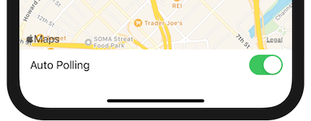
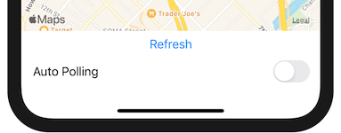

+++
title = "3. The feature request"
date = 2020-05-03

+++
Just as the changes were ready to be merged, a feature request comes in, can the existing code handle changes properly? Is the current strategy for polling strong enough?

**[Skip intro](#skip_intro)**
<!-- more -->

# Background story {#story}
You were ready to request other engineers to review your humble pull request. Still, out of nowhere, a product manager approaches you with concern: Most of the employees using this app are not going to be in the warehouse. When in the warehouse, they can access the legacy system on their computers. Furthermore, warehouses don't have good Wi-Fi coverage anyway.

This product manager wants to bump a feature from milestone 3 into the MVP, the ability to switch between auto-polling and manual refresh.  
Of course, without the features introduced on milestones 1 and 2, this feature doesn't make too much sense. There is no settings page, plus there is no network request queue mechanism, and there is no login/logout, so you complain that the original ticket is not appropriate.  
The product manager creates a new ticket, and with the help from a senior designer, in a couple of minutes, they have something that should be _good enough_ <sup>[1](#1)</sup>. However, without a proper analysis, we are bound to have some questions down the implementation road.  
You can complain that changing the plan is a bad idea, and is ok to raise concerns to question if these changes are worth the trouble, but at the end of the day, that's what the agile manifesto is all about<sup>[2](#2)</sup>. 

The new requirements are:  

- Show a toggle at the bottom of the map to turn auto-polling ON/OFF.
- When auto polling is OFF, a "refresh" button should be visible.
- The "refresh" button fires a network request to get the latest state of the system but does not enable auto-polling.

A coworker recommends creating a PR for the current changes we already have. At the same time, branch out from it and start working on our new feature. This way, we can avoid creating a hella of a big PR with too many changes at once.

As a reminder, all PRs have to:

1. Considers edge cases and non-happy paths
2. Handle errors
3. Introduces new unit tests

||
|-|

# Work {#skip_intro}
### Goal
Add a new feature into the MVP, a toggle to control auto-polling and a "refresh" button to refresh the system state manually:
- Show a toggle at the bottom of the map to turn auto-polling ON/OFF.
- When auto polling is OFF, a "refresh" button should be visible.
- The "refresh" button fires a network request to get the latest state of the system but does not enable auto-polling. 

Comply with the pull request requirements:

1. Considers edge cases and non-happy paths
2. Handle errors
3. Introduces new unit tests

### Code
You need Xcode 11.4 or newer.

You can download the sample apps from [here](https://github.com/Julioacarrettoni/playing-with-rxswift/tree/master/003), you should start working on the _before_ folder. In the end, it should look like the _after_ folder.

&nbsp;  
&nbsp;  
&nbsp;  

#### UI changes

The usual disclaimer applies here, as this blog is not focused on SwiftUI, all the work done in that area is minimal and with a naive approach in mind.  
For this reason, on the `Before` project, you can find that the UI changes already implemented, a very naive way.

<div align="center"></div>

If we wanted to be super technical these are the changes:

```diff
 struct ContentView: View {
     @State var globalState: GlobalState? = nil
+    @State var isAutoPolling: Bool = false
+    
     let disposeBag = DisposeBag()
     
     var body: some View {
-        MapView(globalState: self.globalState)
-            .edgesIgnoringSafeArea(.all)
-            .onAppear(perform: self.refreshData)
+        VStack {
+            MapView(globalState: self.globalState)
+            VStack {
+                if !self.isAutoPolling {
+                    Button(action: {
+                        #warning("Missing implementation")
+                    }) { Text("Refresh") }
+                }
+                Toggle(isOn: self.$isAutoPolling, label: { Text("Auto Polling") })
+            }
+            .padding(.horizontal, 16)
+            .padding(.bottom, 16)
+        }
+        .edgesIgnoringSafeArea(.horizontal)
+        .edgesIgnoringSafeArea(.top)
     }
```

In the real world, given how the ticket was rushed and the lack of specifications, the proper thing to do would be to set a meeting later in the development process to spend some time with the designer 1:1 to pimp this UI up.

A new `Bool` state was added to track the state of the toggle, `isAutoPolling`. Given the value of this boolean, the Button is added or removed from the UI (just changing its opacity is not good enough, you can try yourself). Then a couple of padding was added to make it look less horrible, and the  `edgesIgnoringSafeArea` was split to remove `.bottom` and avoid or toggle from getting behind the "home bar" on iOS.

The first thing we can do is fix the warning in the "refresh" button by calling `self.refreshData()`:

```Swift
Button(action: {
    self.refreshData()
}) { Text("Refresh") }
```

But doing this has a side effect, as soon as we call `refreshData()` the system starts auto polling, to prevent that we can change the method implementation to only keep calling itself if `isAutoPolling` is on. 

```diff
   .subscribe(onSuccess: { globalState in
       self.globalState = globalState
-      self.refreshData()
+      if self.isAutoPolling {
+          self.refreshData()
+      }
   }, onError: { error in
-      self.refreshData()
+      if self.isAutoPolling {
+          self.refreshData()
+      }
   })

```

The only missing part here is that when we set `isAutoPolling` to true, nothing calls  `refreshData()`. To achieve that we could try to leverage `didSet` on the var itself like this:

```diff
-    @State var isAutoPolling: Bool = false
+    @State var isAutoPolling: Bool = false {
+        didSet {
+            if self.isAutoPolling {
+                self.refreshData()
+            }
+        }
+    }
```

As I said, "_try_" you can already imagine this fails. The problem is the automatic biding provided by the `$` sugar syntax from `@state: propertyWrapper`. It doesn't trigger `didSet`.  
One alternative is to wrap the state in an `ObservableObject`. I'll go with option B because I'm lazy, the usual disclaimer applies here: "_This is not a SwiftUI blog blah blah blah_", so maybe don't do this on your real apps without consulting some expert in the matter. Anyway, my solution is to provide a custom instance of [Binding](https://developer.apple.com/documentation/swiftui/binding) by using the [init that takes a get and set closure](https://developer.apple.com/documentation/swiftui/binding/3363053-init).

```swift
Toggle(isOn: Binding(get: {
    self.isAutoPolling
}, set: {
    self.isAutoPolling = $0
}), label: { Text("Auto Polling") })
```

We could just call directly `self.refreshData()` here, but I think keeping it on the `didSet` and this binding as simple as possible is better. (opinion, not fact).

If you rerun the app, you will see that it works, at least half of the time (because we still have that code that makes 50% of the request fail). Even if we don't want to focus too much on usability to keep the post simple and focused, we still need to cover the following 3 points before we can create our fictitious pull request:

1. [Considers edge cases and non-happy paths.](#pr_req_1)
2. [Handle errors.](#pr_req_2)
3. [Introduces new unit tests.](#pr_req_3)

&nbsp;  
&nbsp;  
&nbsp;  

#### 1. Considers edge cases and non-happy paths. {#pr_req_1}

As we still have the [overrideNetworkMock()](https://github.com/Julioacarrettoni/playing-with-rxswift/blob/master/003/Before/RxPlaying/Services/Service.swift#L10-L17) method from the previous post we can run the app and see how it would look like in a scenario were every other network request fails.  
For the auto-polling feature, this is not a big deal because we are automatically retrying on the `onError` closure from the subscribe Rx operator ([here](https://github.com/Julioacarrettoni/playing-with-rxswift/blob/master/003/Before/RxPlaying/Views/ContentView.swift#L24)), but that's not the case for the manual refresh.

Normally any network stack has built-in "retry" and "timeout", but this is not the case with our `FakeService`, so we are going to implement the retry at the application level using the [retry](https://github.com/ReactiveX/RxSwift/blob/c1bd31b397d87a54467af4161dde9d6b27720c19/RxSwift/Traits/PrimitiveSequence.swift#L157) operator:

```swift
/**
     If the initial subscription to the observable sequence emits an error event, try repeating it up to the specified number of attempts (inclusive of the initial attempt) or until it succeeds. For example, if you want to retry a sequence once upon failure, you should use retry(2) (once for the initial attempt, and once for the retry).
     - see also: [retry operator on reactivex.io](http://reactivex.io/documentation/operators/retry.html)
     - parameter maxAttemptCount: Maximum number of times to attempt the sequence subscription.
     - returns: An observable sequence producing the elements of the given sequence repeatedly until it terminates successfully.
     */
public func retry(_ maxAttemptCount: Int)
```

When an error message reaches this operator, it blocks that error message from propagating down the chain, then retries the previous action again. In the context of Singles, that means executing the closure block once again.

The nice thing about it as any other operator is that we can place it anywhere in the stream (as long as we do it before the `subscribe` off course), but this is tricky as depending were we put it we get slighly different results, for example we could place it here:

```diff
Service.systemSingle
    .do(onError: { error in
        print("[\(#function)] ❌ request error: \(error)")
    })
+   .retry(3)
    .subscribe(onSuccess: { globalState in
```

3 seems like a nice number, but you can use whatever makes sense to you.
When you tap the refresh button, logs look like this:

> **[Service] ❌ request error: unknown**
> **[refreshData()] ❌ request error: unknown**
> **[Service] ✅ Success**

It fails but then retries and succeeds. (every other request fails, so on the second attempt it always succeeds)

But if you put it before the `do` like this, the ouput is different:

```diff
Service.systemSingle
+   .retry(3)
    .do(onError: { error in
        print("[\(#function)] ❌ request error: \(error)")
    })
    .subscribe(onSuccess: { globalState in
```

> **[Service] ❌ request error: unknown**
> **[Service] ✅ Success**

What's happening here is that the stream retries 2 more times before letting the error reach the `do` operator and printing the error inside `refreshData()`.

We can modify [this](https://github.com/Julioacarrettoni/playing-with-rxswift/blob/master/003/Before/RxPlaying/Services/Service.swift#L11) line in  [overrideNetworkMock()](https://github.com/Julioacarrettoni/playing-with-rxswift/blob/master/003/Before/RxPlaying/Services/Service.swift#L10-L17) so it always fails:

```swift
var failures = [true]
```

And the log now will look like this:

> **[Service] ❌ request error: unknown**
>
> **[Service] ❌ request error: unknown**
>
> **[Service] ❌ request error: unknown**
>
> **[refreshData()] ❌ request error: unknown**

As you can see, it runs the entire set of operators up to the `retry` 3 times before letting the `error` event go down the chain. 

We could even put the `.retry(3)` higher on the stream, inside the implementation of [**static** **var** systemSingle: Single\<GlobalState\>](https://github.com/Julioacarrettoni/playing-with-rxswift/blob/master/003/Before/RxPlaying/Services/Service.swift#L19). Again, we have different results if we put it before or after the `do`.

The placement of the `retry` is not a trivial decision. It all depends on what is necessary for us to log. Maybe, we want to know of every network request failure, then it should go after the second `do`. Maybe, we want to track every API network request failure, but we consider failure at the application level only when the retry fails, then it should go in between the 2 `do`.  
Maybe, for us, failures are serious when all the retries fail and not per every single network request; in that case, it should be the very first operator in the chain.

I think this last case is the one that makes more sense for this app, so I'll keep the `retry(3)` there.


Now we can say that we have considered non-happy paths, but what about edge cases?


There is a nasty one if the user taps on refresh and immediately turns on auto-polling. The app ends up double auto polling because after the manual refresh ends `self.isAutoPolling` is `true` and thus fires a new request as if it was auto-polling, but we also have another "thread" doing auto-polling. A quick fix for this is introducing a new argument into our function to differentiate auto-poll from manual refresh:

```swift
private func refreshData(autopolling: Bool)
```

```swift
if self.isAutoPolling && autopolling {
    self.refreshData(autopolling: autopolling)
}
```

And call it with `false` on the refresh button, but with `true` on the `didSet`

Now we can say that we have considered edge cases and non-happy paths.

&nbsp;  
&nbsp;  
&nbsp;

#### 2. Handle errors. {#pr_req_2}

There is one error to handle, what happens if after 3 retries the manual refresh fails? Currently, nothing, but to be honest, there isn't too much happening when you press the refresh button anyways.

We could show an alert on the `onError` closure, but that will also show alerts when auto-polling fails, one after the other, that's bad. We can use the `autopolling` boolean and only show the alert with the boolean is `false`, but to be honest, this method is getting a little bloated, there's gotta be a better way.

Let's split it in 2 different methods, but if we do that then we have a lot of duplicated code! To avoid that, we can create a private function to hold what's common to each method, and pass the function name so our log keeps showing relevant information:

```swift
private func fetchGlobalState(from function: String = #function) -> Single<GlobalState> {
    return Service.systemSingle
        .do(onError: { error in
            print("[\(function)] ❌ request error: \(error)")
        })
}
```

And then we can use it on our 2 new methods where we only do what is relevant to each and we get to keep the code as simple as possible:

```swift
private func refresh() {
    self.fetchGlobalState()
        .subscribe(onSuccess: { globalState in
            self.globalState = globalState
        }, onError: { error in
            self.showErrorAlert()
        })
        .disposed(by: self.disposeBag)
}

private func autoPoll() {
    self.fetchGlobalState()
        .subscribe(onSuccess: { globalState in
            self.globalState = globalState
            if self.isAutoPolling {
                self.autoPoll()
            }
        }, onError: { error in
            if self.isAutoPolling {
                self.autoPoll()
            }
        })
        .disposed(by: self.disposeBag)
}
```

I'm going to skip all the problems of showing an alert on SwiftUI as [Paul Hudson](https://www.hackingwithswift.com/about) already did a great job [here](https://www.hackingwithswift.com/books/ios-swiftui/showing-alert-messages), go and read his fantastic website, subscribe, like, retweet and all of that. You can just go and peek the `after` project to find it out.

&nbsp;  
&nbsp;  
&nbsp;  

#### 3. Introduces new unit tests. {#pr_req_3}

Now, we need to ask ourselves "_What assumptions are we making?_", in other words, what can be proven catastrophic in the app if it got changed?

Most of our changes are UI related, but there is one change that we made to the behavior of the service that we can test, and that's the `retry(3)`. Without it, the experience of the app would be significantly degraded. We are going to test that there is a retry mechanism in place. We don't care what it is just as long as when a request fails it gets automatically retried.

Our first test is to make sure the Single gets fired 3 times when the service returns error before failing, so a name for it could be:

- test + **SystemSingle** + **InternallyRetries3Times** +When + **FailsReturnsError** 

You can refresh your memory on how we are writing our tests and the naming convention on the previous post in [this section](/post-002#pr_req_3).

We are going to return `true` always for `FakeService.Current.failNext` to make sure all requests in this test fail.  
We need to ensure that the service call gets retried. One way to do that is to count how many times the `FakeService.Current.failNext` is gets executed, as this closure runs on every fake network request. We have many options for this, like using a local var and then asserting its value. Given the async nature of the whole business, the best approach is to use [XCTestExpectation](https://developer.apple.com/documentation/xctest/xctestexpectation), and it's properties [expectedFulfillmentCount](https://developer.apple.com/documentation/xctest/xctestexpectation/2806572-expectedfulfillmentcount) and [assertForOverFulfill](https://developer.apple.com/documentation/xctest/xctestexpectation/2806575-assertforoverfulfill) which names are pretty straight forward.

```swift
let failNextExpectation = XCTestExpectation(description: "FailNext gets executed 3 times")
failNextExpectation.expectedFulfillmentCount = 3
failNextExpectation.assertForOverFulfill = true
```

This XCTestExpectation fails the test if at the end the expectation was fulfilled less than 3 times and crashes the test with an exception if they get fulfilled more than 3, a little overreaction if you ask me 😅

We can also use a different **XCTestExpectation** to ensure that the `onError:` closure on `subscribe` only gets executed  once:

```swift
let onErrorExpectation = XCTestExpectation(description: "We get an error if the request fails")
onErrorExpectation.expectedFulfillmentCount = 1
onErrorExpectation.assertForOverFulfill = true
```

The whole test now looks like this:

```swift
func testSystemSingleInternallyRetries3TimesWhenFailsReturnsError() throws {
    let failNextExpectation = XCTestExpectation(description: "FailNext gets executed 3 times")
    failNextExpectation.expectedFulfillmentCount = 3
    failNextExpectation.assertForOverFulfill = true
    
    let onErrorExpectation = XCTestExpectation(description: "We get an error if the request fails")
    onErrorExpectation.expectedFulfillmentCount = 1
    onErrorExpectation.assertForOverFulfill = true
    
    FakeService.Current.failNext = {
        failNextExpectation.fulfill()
        return true
    }
    
    let disposeBag = Service.systemSingle
        .subscribe(onSuccess: { _ in
            XCTFail("We shouldn't get a result")
        }, onError: { _ in
            onErrorExpectation.fulfill()
        })
    
    XCTAssertEqual(XCTWaiter.wait(for: [failNextExpectation, onErrorExpectation], timeout: 0.1), .completed)
    disposeBag.dispose()
}
```

As you can see, the test is pretty straightforward to read, and there is no funny business with counters or accumulators.
Now you **should** go ahead and remove the `.retry(3)` call, or change the number of retries, or change the value returned in `FakeService.Current.failNext` and verify that the test indeed fails. Don't take my word for it, and don't take yours either. You should always verify your test fails when they are expected to fail, otherwise the test is useless.

The next thing we can test is that the single succeeds if any of the retries succeeds as well. A name for this test can be:

- test + **SystemSingle** + **Succeeds** + When + **RetrySucceeds**

For that we need to tweak `FakeService.Current.failNext` so it only fails the first time, we can do:

```swift
var failNext = false
FakeService.Current.failNext = {
    failNext.toggle()
    return failNext
}
```

This new code fails every other request starting with a failure.

For the rest we can use 2 **XCTestExpectation** again, to verify that the success closure is called exactly once and that that `FakeService.Current.failNext` is called exactly twice. With all of these changes the will look like these:

```swift
func testSystemSingleSucceedsWhenRetrySucceeds() throws {
    let failNextExpectation = XCTestExpectation(description: "FailNext gets executed 2 times")
    failNextExpectation.expectedFulfillmentCount = 2
    failNextExpectation.assertForOverFulfill = true
    
    let successExpectation = XCTestExpectation(description: "We get a success event")
    successExpectation.expectedFulfillmentCount = 1
    successExpectation.assertForOverFulfill = true
    
    var failNext = false
    FakeService.Current.failNext = {
        failNextExpectation.fulfill()
        failNext.toggle()
        return failNext
    }
    
    let disposeBag = Service.systemSingle
        .subscribe(onSuccess: { _ in
            successExpectation.fulfill()
        }, onError: { _ in
            XCTFail("It shouldn't fail.")
        })
    
    XCTAssertEqual(XCTWaiter.wait(for: [failNextExpectation, successExpectation], timeout: 0.1), .completed)
    disposeBag.dispose()
}
```

As I said before, change some numbers, change the retry, do whatever change you deem necessary to verify that the test is working and catching errors.
 
As you might have discovered if you followed my advice, when an expectation fails it hard to tell which one did, if instead of  `XCTAssertEqual(XCTWaiter.wait(for:, timeout:), .completed)` we used `self.wait(for:, timeout:)` tests would fail more gracefully. Sadly there is a bug currently affecting the correctness of this API, it was believed to be fixed recently, but it wasn't.

The bug mostly makes tests way slower on big projects. If the current way fails and you have more than one expectation you can switch temporarily to `self.wait(for:, timeout:)` to get a better error message or if your project is small and you don't care if it takes a little longer to run the tests just stick with the simpler version. Hopefully, it will be fixed soon 🤞.

&nbsp;  
&nbsp;  
&nbsp;  

||
|-|

# Conclusion

If we look at all the changes we made, our current implementation holds it pretty well. The polling mechanism is still quite weak but is good enough.  
We leveraged the power of RxSwift by using the [retry](https://github.com/ReactiveX/RxSwift/blob/c1bd31b397d87a54467af4161dde9d6b27720c19/RxSwift/Traits/PrimitiveSequence.swift#L157) operator.  
We saw how easy it is to share code between different consumers of the same Single by splitting the method and have one holding the common operator for the others.

We also added some helpful tests to safeguard our code quality.

Now before we open the PR, we should double-check with the designer and see if they have any suggestions… (yes, another cliff hanger)

&nbsp;  
&nbsp;  

||
|-|

##### Footnotes
<a id='1'>1</a>: If this story hits close to home, please accept my condolences.  
<a id='1'>
<a id='2'>2</a></a>: [Agilemanifesto.org](https://agilemanifesto.org) "**Responding to change** over following a plan".